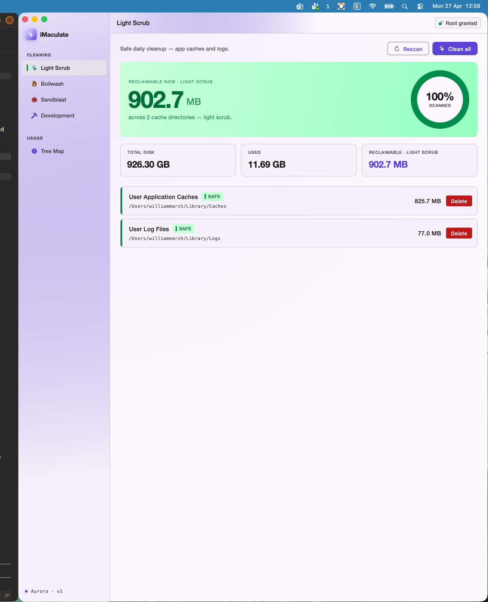

# iMaculate

> A native macOS cache cleaner built in Flutter — four cleanup modes, a live disk tree-map, and a Trash-first deletion policy so you never lose anything you didn't mean to.

<p align="center">
  
</p>

<p align="center">
  
  
  
  
</p>

---

## Showcase

<p align="center">
  
  <br/>
  <em>Cleaner — Light Scrub mode. Risk-tagged caches, one-click reclaim, live total.</em>
</p>

> Additional screenshots (Tree Map, Splash, Permission prompt) and demo gifs go under [`docs/screenshots/`](docs/screenshots) and [`docs/gifs/`](docs/gifs). See [`docs/screenshots/CAPTURE.md`](docs/screenshots/CAPTURE.md) for the exact filenames + sizes the README will pick up — the showcase block expands automatically once they're committed.

---

## Why this exists

macOS quietly hoards gigabytes in caches, derived data, simulator runtimes, and old archives. The built-in tools don't show *where* the bytes went, and most third-party cleaners either delete too aggressively or hide what they're touching.

iMaculate's design rules:

1. **Show the path, the size, and the risk** before anything is touched.
2. **Trash first, delete second** — moves go to Finder's Trash by default; permanent removal is opt-in.
3. **Privilege only when needed** — system caches require admin; everything else runs as your user.
4. **No network. No telemetry.** Disk only.

---

## Cleaning modes

| Mode                | Icon | Targets                                        | Typical reclaim | Risk                          |
| ------------------- | ---- | ---------------------------------------------- | --------------- | ----------------------------- |
| **Light Scrub**  ✨  | ✨    | `~/Library/Caches`, `~/Library/Logs`           | 100 MB – 1 GB   | Safe for daily use            |
| **Boilwash**     🔥 | 🔥   | + Xcode DerivedData, iOS sim caches, `/Library/Caches` | 1 – 10 GB       | Generally safe                |
| **Sandblast**    💥 | 💥   | + `/Library/Updates`, `/var/log`, Xcode archives, iOS device backups | 5 – 30+ GB      | Advanced — admin required     |
| **Development**  🛠️ | 🛠️   | Homebrew, npm, pip, Gradle, Cargo, Maven, Docker VMs, AVDs, Xcode | 2 – 50+ GB      | Mixed — re-downloads on demand |

Exact paths live in [`lib/data/cleaning_targets.dart`](lib/data/cleaning_targets.dart). Each entry carries a `RiskLevel` (`safe`, `moderate`, `higher`) that drives the chip colour and the deletion path.

> **Boilwash** is named for the laundry cycle — hot enough to clean, not hot enough to ruin the fabric. **Sandblast** is the "I know what I'm doing" mode.

---

## How deletion actually works

Cache removal funnels through two services:

- [`TrashService`](lib/services/trash_service.dart) — default path. Calls Finder via `osascript` to move the entry to the Trash. Recoverable.
- [`CacheRemover`](lib/services/cache_remover.dart) — used for `RiskLevel.higher` items when the user has granted admin. Runs `find … -mindepth 1 -delete` under `osascript ... with administrator privileges` so the cache *parent* directory survives (apps that re-create their own cache get unhappy when the parent vanishes).

Sizes come from [`CacheScanner`](lib/services/cache_scanner.dart): privileged scans use `du -sk`; unprivileged scans walk the tree in Dart and skip what they can't read. Either way, scans are async and the UI stays interactive.

---

## Architecture at a glance

```
lib/
├── main.dart                 # Entry — runs IMaculateApp
├── app.dart                  # Theme + first-launch gate (splash vs. shell)
├── data/
│   └── cleaning_targets.dart # Hard-coded paths per cleaning mode
├── models/                   # CacheTarget, CacheEntry, CleaningLevel, NavSelection, …
├── screens/
│   ├── splash_screen.dart    # Aurora intro shown once per machine
│   ├── home_shell.dart       # Sidebar + app bar shell, holds NavSelection
│   ├── cleaner_screen.dart   # Per-mode cache list + reclaim flow
│   └── tree_map_screen.dart  # Live disk drill-down view
├── services/
│   ├── permission_service.dart   # osascript-based admin escalation
│   ├── path_resolver.dart        # `~`, `$USER`, absolute path expansion
│   ├── cache_scanner.dart        # du -sk / fallback walk
│   ├── cache_remover.dart        # Privileged empty-in-place
│   ├── trash_service.dart        # Default: send to Finder Trash
│   ├── disk_scanner.dart         # Tree-map streaming scan
│   ├── disk_stats_service.dart   # Total / free space lookup
│   └── first_launch_service.dart # Splash gate marker
├── theme/                    # AppTheme + Aurora colour tokens + risk palette
├── utils/                    # byte_formatter, splash animation curves
└── widgets/                  # Aurora sidebar/app-bar, donut, scan ring, splash bits
```

---

## Run / rebuild

### Prerequisites

- macOS 10.15+
- Flutter SDK 3.0 or newer (`flutter --version`)
- Xcode + Command Line Tools (CocoaPods picks these up for the macOS shell)
- Optional: an admin password handy for the Sandblast / system-cache flows

### One-shot rebuild

```bash
git clone https://github.com/will-march/imaculate.git
cd imaculate
flutter pub get
flutter run -d macos
```

### Clean rebuild (when something feels off)

```bash
flutter clean
rm -rf macos/Pods macos/Flutter/ephemeral build .dart_tool
flutter pub get
flutter run -d macos
```

### Release build

```bash
flutter build macos --release
open build/macos/Build/Products/Release/iMaculate.app
```

The signed `.app` lands in `build/macos/Build/Products/Release/`. Drag it to `/Applications` to install.

### Tests

```bash
flutter test
```

Unit tests live under [`test/`](test). The cache/trash services are deliberately thin wrappers over `osascript` so they're easy to fake in tests.

---

## Permissions

On launch, [`PermissionService`](lib/services/permission_service.dart) fires a single `osascript … with administrator privileges` call. The macOS auth ticket lasts ~5 minutes, so subsequent privileged operations don't re-prompt during a normal session.

| Lock state | Meaning                              | What you can clean                   |
| ---------- | ------------------------------------ | ------------------------------------ |
| 🔓 Open    | Admin granted                        | Everything in the four modes         |
| 🔒 Closed  | Standard user                        | User-scope caches only — no `/Library`, no `/var` |

Decline the auth dialog and the app stays useful — just a smaller blast radius.

---

## Project status / roadmap

- [x] Light / Boilwash / Sandblast / Development modes
- [x] Trash-first deletion with admin opt-in
- [x] Live tree-map drill-down
- [x] First-launch splash with Aurora theme
- [ ] Scheduled / unattended cleans
- [ ] Per-app exclusion lists
- [ ] Cleaning history + before/after report
- [ ] Localisation

---

## Contributing

PRs are welcome. Two house rules:

1. **Don't add a path to `cleaning_targets.dart` without a `RiskLevel`.** The UI fans out from that field.
2. **Privileged operations must go through `osascript`** with quoted-form escaping — see `CacheRemover._privilegedEmpty` for the pattern. Don't shell out raw paths.

Run `flutter analyze` and `flutter test` before opening a PR.

---

## Privacy

iMaculate doesn't talk to the network. Ever. There's no analytics, no crash reporting, no auto-updater. The entire surface area is local disk + Finder + `osascript`.

---

## Licence

MIT. See [`LICENSE`](LICENSE) once added — until then, treat the source as MIT-licensed (see commit history for authorship).

---

<p align="center"><sub><em>iMaculate — keep your Mac clean, keep your data.</em></sub></p>
